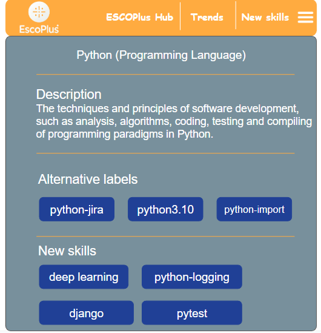

# ESCOPlus Framework

**ESCOPlus** is an open-source framework designed to enhance the ESCO taxonomy by integrating emerging digital skills extracted from community-driven platforms like Stack Overflow. It provides a data-driven, expert-validated extension to ESCO, supporting workforce development, job matching, and curriculum design in the evolving labor market.

## 🔍 Overview

ESCOPlus follows a three-phase methodology:

1. **VISION**: Extract skills from Stack Overflow using tag co-occurrence and frequency filtering.
2. **ACTION**: Apply association rule mining and cosine similarity to detect alternative and new skills.
3. **PLAN**: Validate skills with expert feedback and integrate them into a structured extension of the ESCO taxonomy.

)

## 📁 Project Structure


## ⚙️ Key Features

- Skill extraction from Stack Overflow
- Taxonomy enrichment via association rules and cosine similarity
- Expert validation layer for added reliability
- Interactive GUI for skill exploration
- Modular and extendable architecture

## 📊 Technologies Used

- Python 3.x
- pandas, scikit-learn, numpy
- NetworkX, matplotlib
- Streamlit or Flask (for GUI)
- PostgreSQL (for taxonomy storage)

## 🚀 Getting Started

```bash
git clone https://github.com/yourusername/escoplus-framework.git
cd escoplus-framework
pip install -r requirements.txt
```

## 🖥️ Visual Interface

ESCOPlus also includes an intuitive web-based GUI to explore and validate skills. Users can:

- Browse ESCO and non-ESCO skills
- Visualize skill associations and similarity scores
- Review suggested alternative and new skills

### 📸 GUI Preview




